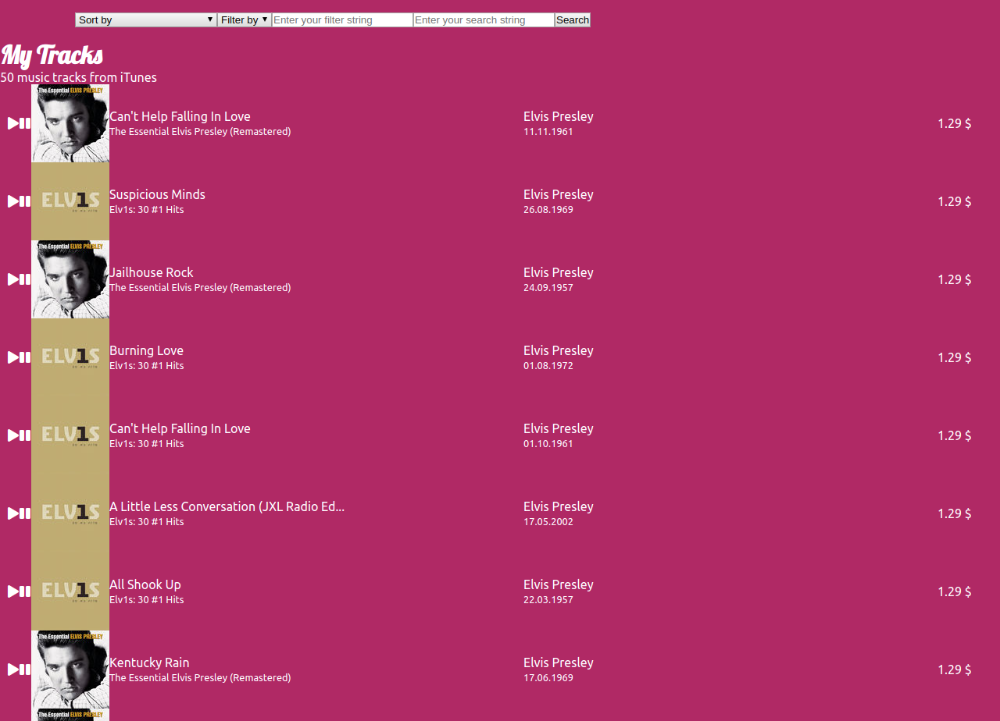

# Sound of react

This webpage was created by Stefan Klinkusch at Digital Career Institute in Berlin, Germany using React.js.

## Components

This page consumes the iTunes API and lists up to 50 tracks fitting to the request you did. It features
- sorting
  - by song title, A-Z and Z-A
  - by artist name, A-Z and Z-A
  - by album name, A-Z and Z-A
  - by release date, chronologically and anti-chronologically
  - by price, ascending and descending
- filtering
  - by artist name
  - by song title
  - by album title
- play and pause title

Shown is the following data:
- cover image (only for wide screens)
- song title
- album title
- artist name
- release date
- price

## Screenshot

## Link

The page can be found at [Now.sh](https://sound-of-react.sklinkusch.now.sh).

## Task

> Remember sound of silence? Let's refactor it into react 💃

## Components

- Track-List
- Track-List-Item
- Search-Bar
- App-Logic-Component
  - Should be in charge of network requests etc.

## Hints

- Feel free to copy your html and css from previous exercise
- use `https://dci-fbw12-search-itunes.now.sh/?term=${search}` to fetch data
